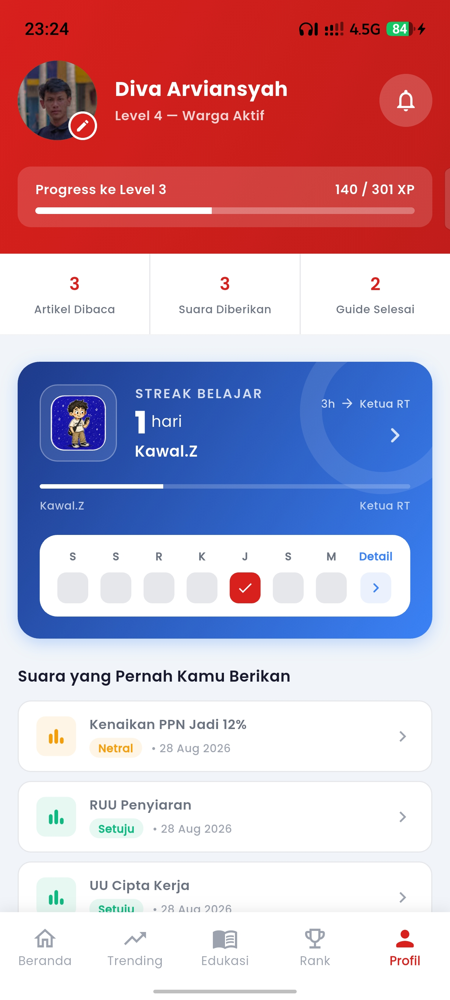

<div align="center">

  

  <p align="center">
    
  </p>

  # Kawal.Z

  **Kawal.Z adalah platform civic-tech interaktif yang memberdayakan Gen Z Indonesia untuk memahami, memantau, dan berpartisipasi dalam kebijakan publik dengan cara yang fun dan engaging.**

  <br />

  
  
  
  

</div>

---

## Table of contents

- [Project overview](#project-overview)
- [Key features](#key-features)
- [Technology stack](#technology-stack)
- [Project structure](#project-structure)
- [Getting Started](#getting-started)
- [Team](#team)

## Project overview

| Item | Details |
| --- | --- |
| Application Type | Mobile (Cross-platform) |
| Primary Platform | Android & iOS |
| Target Audience | Gen Z Indonesia (13-25 tahun) |

Kawal.Z adalah aplikasi yang mengubah cara Gen Z Indonesia memahami dan berinteraksi dengan kebijakan publik. Platform ini menyediakan ringkasan kebijakan yang mudah dipahami (AI TL;DR), gamifikasi untuk meningkatkan engagement, dan wadah diskusi komunitas. Dengan fitur voting interaktif dan leaderboard, pengguna dapat mengawal jalannya kebijakan sambil belajar tentang isu-isu sosial, ekonomi, hukum, dan politik yang relevan dengan kehidupan mereka.

## Key features

| Feature | What the user can do |
| --- | --- |
| Trending Policies Feed | Melihat kebijakan trending minggu ini dengan ringkasan AI dan estimasi waktu baca |
| Personalized Feed | Mendapatkan rekomendasi kebijakan berdasarkan topik minat yang dipilih |
| Interactive Voting | Memberikan suara setuju/tidak setuju terhadap kebijakan dan melihat statistik voting komunitas |
| Comment & Discussion | Berdiskusi dan memberikan tanggapan terhadap setiap kebijakan dengan komunitas |
| AI Chatbot Assistant | Bertanya kepada AI assistant untuk penjelasan lebih lanjut tentang kebijakan |
| Gamification & Leaderboard | Mengumpulkan XP dari aktivitas dan berkompetisi di leaderboard mingguan/bulanan |
| Education Hub | Mempelajari konsep-konsep dasar tentang kebijakan publik melalui flashcard interaktif |
| Streak Tracking | Mempertahankan daily streak untuk konsistensi dalam belajar dan berpartisipasi |
| Profile Customization | Mengatur avatar, nama, dan topik minat untuk pengalaman yang personal |
| Authentication | Login dengan email/password atau Google Sign-In |

## Technology stack

| Category | Technology | Purpose |
| --- | --- | --- |
| Frontend | Flutter + Dart | Cross-platform mobile development |
| Architecture | Clean Architecture + Riverpod | Modular codebase dengan state management yang scalable |
| State Management | Riverpod | Reactive state management dan dependency injection |
| Routing | GoRouter | Navigation management yang powerful dan type-safe |
| Backend | Supabase | Backend-as-a-Service dengan PostgreSQL database |
| Database | PostgreSQL | Menyimpan policies, users, comments, dan voting data |
| Authentication | Supabase Auth + Google Sign-In | Autentikasi pengguna yang aman |
| AI Integration | Google Generative AI | Untuk TL;DR policy summaries dan chatbot |
| UI Components | Flutter Material 3 | Komponan UI modern dan konsisten |
| Image Handling | Cached Network Image | Caching gambar untuk performa optimal |
| Local Storage | Shared Preferences | Menyimpan preferensi user lokal |
| Charts | FL Chart | Visualisasi data voting dan statistics |
| HTTP Client | http | Request ke external APIs |

## Project structure

```text
lib/
├── core/
│   ├── constants/          # App colors, text styles, sizes
│   ├── routing/            # Route definitions dan app router
│   ├── services/           # Supabase, OnboardingService, dll
│   ├── utils/              # Error handler, snackbar utils, dll
│   └── widgets/            # Reusable widgets (AppAvatar, AppShimmer, dll)
├── features/
│   ├── auth/               # Login, register, splash screen
│   ├── home/               # Trending feed, article detail, comments
│   ├── education/          # Flashcard categories dan viewer
│   ├── leaderboard/        # User rankings dan statistics
│   ├── profile/            # User profile, streak tracking
│   ├── chatbot/            # AI assistant integration
│   ├── topic_selection/    # Topic onboarding
│   └── onboarding/         # App onboarding screens
├── main.dart               # Entry point aplikasi
├── app.dart                # App setup dan theme
└── pubspec.yaml            # Dependencies

assets/
├── images/                 # PNG images (mascots, etc)
├── icons/                  # SVG & PNG icons
└── streaks/                # Streak milestone assets
```

## Getting Started

To get a local copy up and running, follow these simple steps.

### Prerequisites

- Flutter SDK (version 3.12.2 or higher) installed on your machine
- Dart SDK (bundled with Flutter)
- Android Studio or VS Code with Flutter extension
- A Supabase project account (for backend)
- Google OAuth credentials (for Sign-In)

### Installation

1. **Clone the repo**
   ```sh
   git clone https://github.com/divarvian/raion-hackjam-13.git
   cd raion-hackjam-13
   ```

2. **Install dependencies**
   ```sh
   flutter pub get
   ```

3. **Setup environment variables**
   - Create a `.env` file in the project root
   - Add your Supabase URL, API key, and Google OAuth client ID:
     ```
     SUPABASE_URL=your_supabase_url
     SUPABASE_ANON_KEY=your_anon_key
     GOOGLE_WEB_CLIENT_ID=your_google_client_id
     ```

4. **Run the app**
   ```sh
   flutter run
   ```

---

## Team

| Name | Role | Contact |
| --- | --- | --- |
| Aisyah Berlianti | Product Manager | [GitHub / LinkedIn] |
| Lintang | UI/UX Designer | [GitHub / LinkedIn] |
| Diva Arviansyah | Mobile Engineer | [GitHub / LinkedIn] |